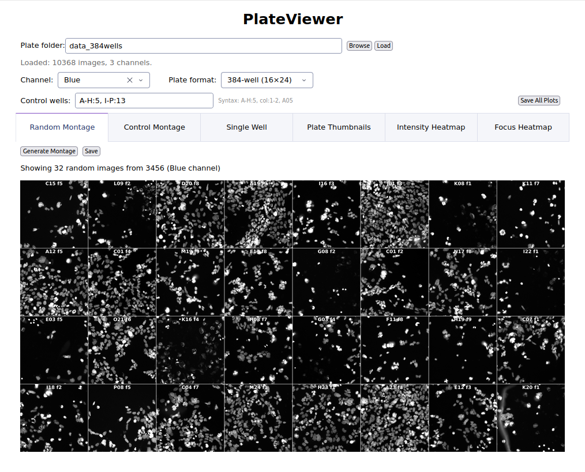
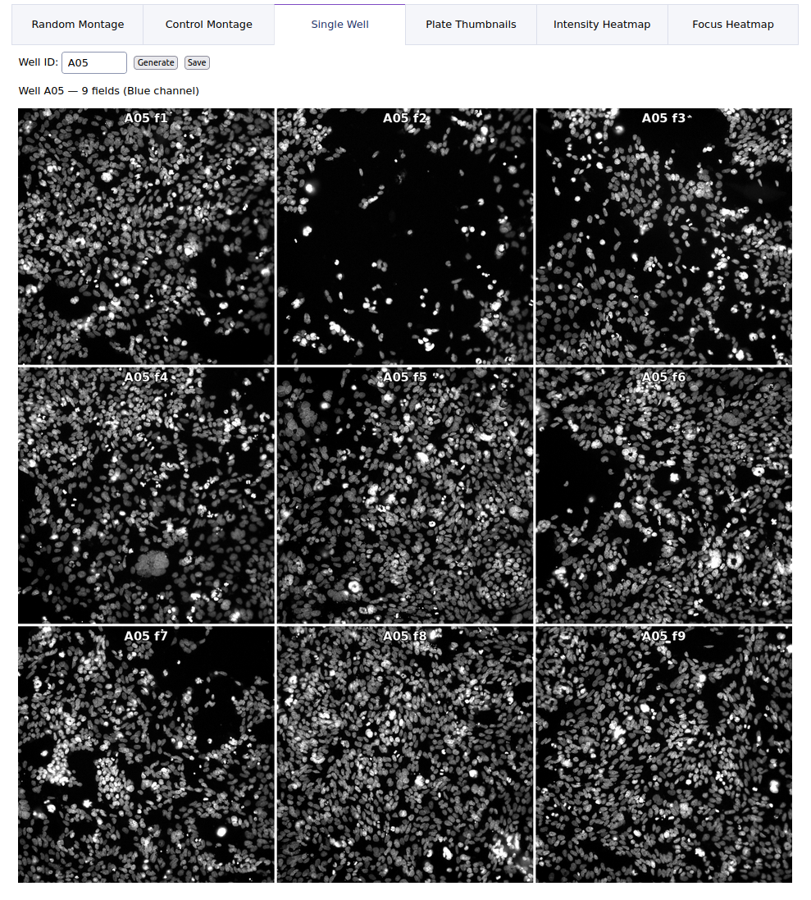
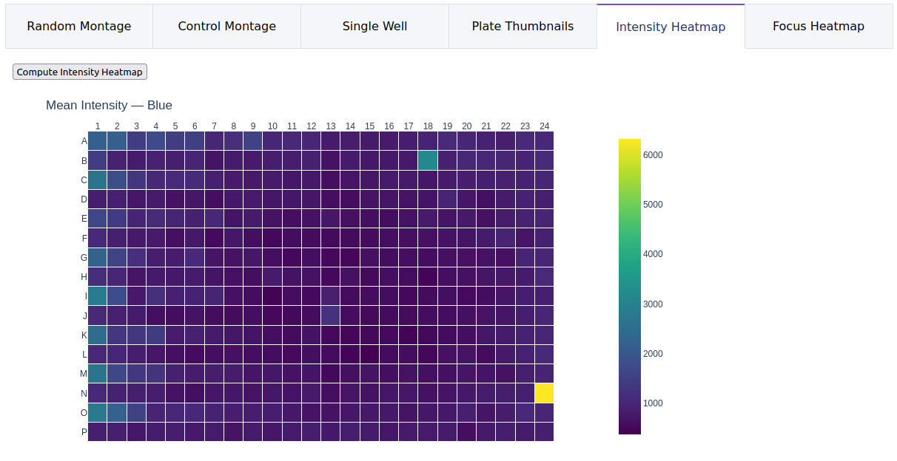
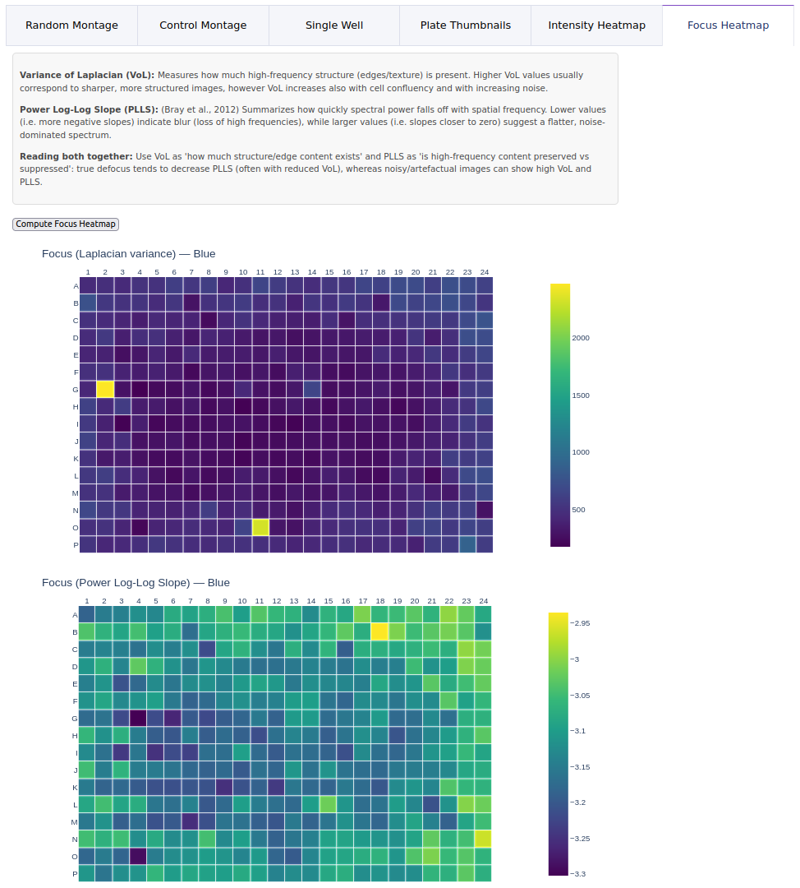

# PlateViewer

Quality control visualization tools for arrayed high-content screening experiments (384-well and 96-well plates).

PlateViewer helps microscopists and screening scientists quickly assess image quality across entire plates. It flags out-of-focus wells, reveals intensity patterns such as edge effects or dispensing artifacts, and lets you visually inspect any well or field — all from a browser-based interface.

## Requirements

- Python 3.11+
- Images must be TIFF files (`.tif`) following the **GE InCell Analyzer** naming convention (see [Expected File Naming](#expected-file-naming) below)

## Installation

```bash
conda create -n PlateViewer python=3.11
conda activate PlateViewer
pip install .
```

For development (editable install — changes take effect immediately):

```bash
pip install -e .
```

To reproduce the exact tested environment, use the pinned lockfile instead:

```bash
pip install -r requirements.txt
```

## Usage

```bash
conda activate PlateViewer
plateviewer
```

The browser opens automatically. Use `--port 8051` to change the port.

#### Workflow

1. Enter the plate folder path (or click **Browse**, or drag-and-drop) and click **Load**
2. Select a channel and plate format (384-well or 96-well)
3. Optionally enter control well specifications
4. Use the tabs:
   - **Random Montage**: 4x8 grid of randomly sampled images with well/field labels
   - **Control Montage**: 4x8 grid sampled from user-specified control wells
   - **Single Well**: all fields for a chosen well in an auto-sized grid (full images, 4x downsampled)
   - **Plate Thumbnails**: plate-layout overview with one thumbnail per well (auto-detected center field, hover for well ID)
   - **Intensity Heatmap**: mean pixel intensity per well (plate layout)
   - **Focus Heatmap**: two heatmaps — Variance of Laplacian (VoL) and Power Log-Log Slope (PLLS) — with an interpretation guide explaining how to read them together.
5. Click **Save All Plots** to export all plots as PNGs. By default they are saved to `~/PlateViewer_output/<plate_name>/output/`; use the output folder field to choose a different location.

_Note: Heatmap results are cached as `.npy` files under `~/PlateViewer_output/<plate_name>/cache/`. Delete them to force recomputation._


#### Expected File Naming:

Images must follow the GE InCell Analyzer naming convention:
```
ROW - COL(fld FIELD wv WAVELENGTH - CHANNEL).tif
```
Example: `A - 01(fld 1 wv 390 - Blue).tif`


#### Control well syntax:

| Format | Meaning |
|--------|---------|
| `A-H:5` | Rows A through H, column 5 |
| `I-P:13` | Rows I through P, column 13 |
| `col:1-2` | All rows, columns 1 and 2 |
| `A01` | Single well |
| `A01-A09` | Well range within a row |

Combine with commas: `A-H:5, I-P:13`


## Functionality

#### Random Montage

Inspect a subset of randomly selected images from the entire plate, corresponding to the chosen channel.



#### Single Well

Inspect all fields of a specific well. Enter a well ID (e.g. A05) to see every acquired field arranged in a grid, useful for investigating outliers spotted on heatmaps.



#### Plate Thumbnails

Bird's-eye view of the entire plate. Each cell shows a thumbnail of the center field for that well. Hover over any thumbnail to see the well ID.


#### Intensity Heatmap



Mean pixel intensity per well. Reveals systematic patterns such as edge effects or dispensing artifacts.

#### Focus Heatmaps

Two complementary metrics are shown:

- **Variance of Laplacian (VoL)** — measures edge/texture content. Higher values indicate sharper images, but VoL also increases with cell confluency and noise.
- **Power Log-Log Slope (PLLS)** (Bray et al., 2012) — summarizes how quickly spectral power falls off with spatial frequency. More negative values indicate blur; values near zero suggest sharp or noise-dominated images.




## Dependencies

| Package | Purpose |
|---------|---------|
| [Dash](https://dash.plotly.com/) | Web UI framework |
| [Plotly](https://plotly.com/python/) | Interactive plotting |
| NumPy | Numerical computation |
| SciPy | Scientific computing |
| Pillow | Image I/O and processing |
| scikit-image | Image resizing (contact sheet thumbnails) |
| tifffile | TIFF file reading |
| Kaleido | Static image export |

All dependencies are installed automatically via `pip install .`.

On Debian/Ubuntu, the **Browse** button requires `python3-tk`, which is not available through pip:

```bash
sudo apt install python3-tk
```


## Project Structure

```
plateviewer/           — Python package (installed via pip)
    app.py             — Dash web UI and entry point
    config.py          — Centralized constants (montage params, font path, threading, etc.)
    paths.py           — Output and cache path resolution
    plate.py           — Plate-level logic: file discovery, filename parsing, well utilities
    image.py           — Image utilities: uint8 conversion, label burning, PNG encoding
    montage.py         — Montage assembly (random, single-well, contact sheet)
    heatmaps.py        — Plate heatmap computation (threaded I/O, disk caching)
pyproject.toml         — Package metadata and dependencies
requirements.txt       — Pinned dependency versions (reproducible environment)
```


## License

[MIT License](LICENSE)  
Copyright (c) 2026 E. Athena Economides

**E. Athena Economides, PhD**  
Prof. Adriano Aguzzi Lab  
Institute of Neuropathology  
University of Zurich & University Hospital Zurich  
Schmelzbergstrasse 12  
CH-8091 Zurich  
Switzerland  
